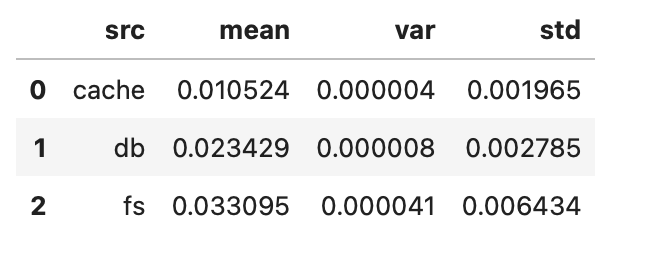

# MINIcache

My goal with this was to figure out, what a cache's fundamental building blocks are, i.e., how does a cache work in a super simple scenario. The scenario here is that the cache exclusively stores files, or rather the bytes representing them. For this we have a tiny API `minicache.py` (written in fastapi) through which a client can upload/download files. (The well known alexnet paper is used as an example here.)

In the next step, I wanted to see how retrieval times compare for such a cache vs file system (or even database). Therefore, we additionally store each uploaded file on the server's file system, or in a database (sqlite3) respectively. I came across this cache definition by Amazon which is already pretty nice:
> In computing, a cache is a high-speed data storage layer which stores a subset of data, typically transient in nature, so that future requests for that data are served up faster than is possible by accessing the data’s primary storage location. Caching allows you to efficiently reuse previously retrieved or computed data.

So, the case for a cache is speed and efficiency, besides, the data that it stores needs to be only temporary accessible - at the same time its source is probably permanently stored somewhere on disk or in a database. In the end, a cache is trades off storage capacity and durability for speed and lower latency (gains).

## Results

Turns out a cache can be as simple as a python dictionary (`dict = {}`) to resemble a key-value store (in fast RAM memory). For starters, the cache needs to support the basis operations: add (rather put), get, and delete. Besides, we want to set an upper bound for the memory which the cache is allowed to use. For this contrived example we set the memory limit to 5 MiB (Mebibyte). Whenever we put something in the cache, we sum up the current memory usage across all entries, and remove the oldest ones (FIFO) to stay within the memory limit.

Something else to consider is for how long an entry is cached, this gets us right away to time to live (ttl) of an entry. Here, we simply (lazy) delete the entry, when we try to get the entry from the cache, but realize that its ttl has already run out. The Memcached python package handles tll similarly (iirc). Lastly, we need a mechanism to check, if the cache contains what the client is requesting. We can base the key (under which to store the entry) on a subset of the request's metadata, e.g., the name of the requested file, or from which host it is requested (and potentially many more). For simplicity, we combine exactly these two to a string and hash it, resembling our key.

In this contrived example - just one client requesting the same file repeatedly - cache retrieval is ~2X faster (on avg) than retrieval from the server's file system (~3X faster than database retrieval). This is by no means representative, but it indicates what you would expect, namely, cache retrieval is the fastest.

